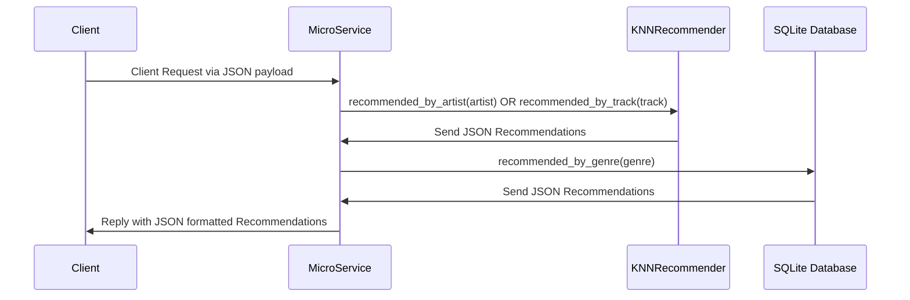

# Microservice A - Music Recommender

Edgar Rosales
CS 361 
08/04/2025


## Set up Environment

### Install git-lfs

The project consists of files exceeding GitHubs repo file size limits; two .csv files necessary to load into a pandas dataframe. 
Hence its necessary to install the git-lfs package to download the large files hosted elsewhere on GitHub.

Install [Git Large File Storage](https://git-lfs.com/)


### Clone Repo

Clone the repo hosted in the following repo: https://github.com/erosalesj/musicKNNRecommender#

Ensure the .csv files were downloaded. 

### Create a virtual environment
Navigate to the downloaded directory a create a virtual python environment to install all required dependencies. 

```bash
python -m venv venv
```
### Activate the virtual environment

```bash
source venv/bin/activate  # macOS/Linux

venv\Scripts\activate     # Windows
```
### Install dependencies

```bash
pip install -r requirements.txt
```

## Communication Contract

The microservice runs locally using the TCP protocol to listen on port 5555

tcp://localhost:5555

## Requesting Data

### Example JSON Request Payloads

#### Requesting  by Music Genre
```json
request_payload = {
    "type": "recommend_by_genre",
    "genre": "music_genre"
}
```

#### Requesting by Artist
```json
request_payload = {
    "type": "recommend_by_artist",
    "artist": "artist_name"
}
```

#### Requesting  by Song
```json
request_payload = {
    "type": "recommend_by_track",
    "track": "song_name"
}
```

### Example Request (Python)

```json

import zmq
import json

context = zmq.Context()

print("Connecting to server")
socket = context.socket(zmq.REQ)
socket.connect("tcp://localhost:5555")

request_payload = {
    "type": "recommend_by_track",
    "track": "Crimewave"
}

socket.send_json(request_payload)

message = socket.recv()
print(f"Received reply {message}")
```

## Receiving Data

As long as Microservice is running 

```bash
python zeroMQServer.py
```

The client will receive data in the following format:

```json
{"recommendations": [
    {"title": "Hey Brother", "artist": "Avicii", "genre": "dance", "popularity": 77}, 
    {"title": "Roar", "artist": "Katy Perry", "genre": "dance", "popularity": 77}, 
    {"title": "Heart Attack", "artist": "Demi Lovato", "genre": "dance", "popularity": 76}, 
    {"title": "The Way", "artist": "Ariana Grande", "genre": "dance", "popularity": 67}, 
    {"title": "Dark Horse", "artist": "Katy Perry", "genre": "dance", "popularity": 78}]}
```

## UML Diagram




